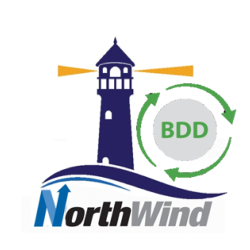

# 📊 North_Wind_BI: Advanced Business Intelligence Dashboard

<p align="center">
  
</p>

<div align="center">

  [](https://powerbi.microsoft.com/)
  [](https://learn.microsoft.com/en-us/power-query/)
  [](https://support.microsoft.com/en-us/excel-powerpivot)
  [](https://dax.guide/)

  [📺 Watch Demo](#-demo) | [🎯 Features](#-key-features) | [🏗️ Project Structure](#-project-structure) | [🚀 How to Use](#-how-to-use)
  
</div>

---

## 🎥 Demo
<p align="center">
  
</p>


---

## 🎯 Key Features

✅ **Sales & Revenue Trends** – Track **growth patterns, YoY performance, and KPIs**.  
✅ **Product & Supplier Insights** – Identify **top-selling products and key suppliers**.  
✅ **Customer Behavior Analysis** – Segment purchasing trends **by region and category**.  
✅ **KPI Benchmarking** – Compare **Actual Revenue vs. Projected Revenue**.  
✅ **What-If Analysis** – Simulate **price changes and impact on revenue**.  
✅ **Advanced Filtering & Interactivity** – Drill-downs, slicers, and dynamic reports.  

---

## 🏗️ Project Structure

```plaintext
North_Wind_BI/
├── 📊 Analysis.pbix            # Power BI Dashboard
├── 📄 Analysis_Report_PP_PQ.xlsx # Power Pivot & Power Query Data
├── 📂 Data/                    # Raw & Processed Data
├── 📜 README.md                # Project Documentation
└── 🎥 demo.gif                 # Demo Animation
